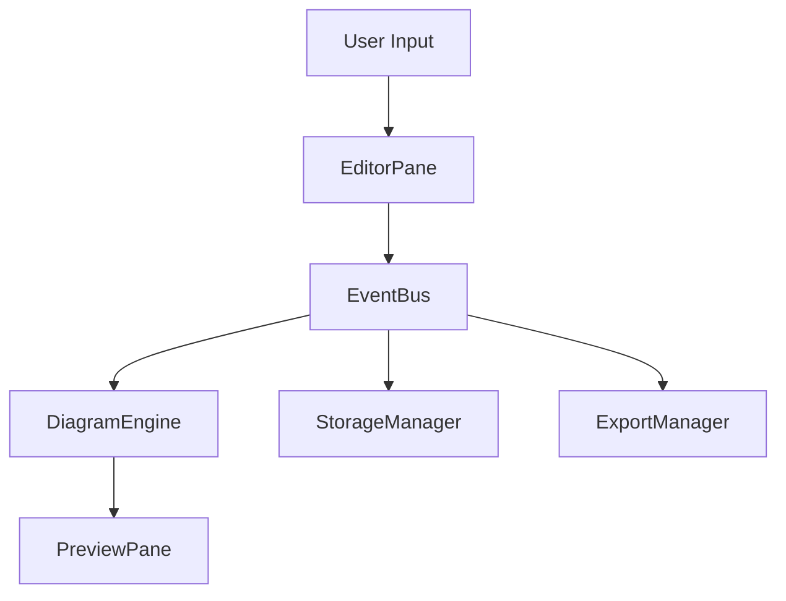

# Mermaid Editor Architecture

## Overview

The Mermaid Editor follows a modular architecture designed for maintainability, extensibility, and performance. The codebase is organized into distinct modules that communicate through well-defined interfaces.

## Core Architecture Principles

1. **Separation of Concerns**: Each module handles a specific aspect of functionality
2. **Event-Driven Communication**: Loose coupling between components via events
3. **Progressive Enhancement**: Core functionality works without JavaScript, enhanced features added progressively
4. **Mobile-First Responsive**: Designed for all screen sizes

## Directory Structure

```
mermaid/
├── src/                    # ES6 source modules
│   ├── core/              # Core editor functionality
│   ├── ui/                # User interface components
│   ├── utils/             # Utility functions
│   └── config/            # Configuration files
├── js/                    # Compiled JavaScript modules
│   ├── bundles/           # Bundled modules for production
│   └── modules/           # Individual module files
├── css/                   # Modular stylesheets
│   ├── base/              # Base styles and resets
│   ├── components/        # Component-specific styles
│   └── themes/            # Theme definitions
├── views/                 # Alternative implementations
└── versions/              # Historical versions
```

## Key Components

### 1. Editor Core (`src/core/`)
- **EditorCore.js**: Main editor initialization and coordination
- **DiagramEngine.js**: Mermaid.js wrapper for rendering
- **StorageManager.js**: Handles persistence (localStorage, files)
- **EventBus.js**: Central event management

### 2. User Interface (`src/ui/`)
- **Toolbar.js**: Action buttons and controls
- **EditorPane.js**: CodeMirror integration
- **PreviewPane.js**: Diagram rendering area
- **ThemeManager.js**: Theme switching logic

### 3. Utilities (`src/utils/`)
- **ExportManager.js**: Handles PNG/SVG/PDF exports
- **FileHandler.js**: File I/O operations
- **Validator.js**: Syntax validation
- **Debounce.js**: Performance optimization

## Module Communication



## Data Flow

1. **User types** in EditorPane (CodeMirror)
2. **Change event** fired to EventBus
3. **DiagramEngine** receives update, validates syntax
4. **Preview updated** if syntax is valid
5. **Auto-save triggered** after debounce period

## Build System

### Development Build
```bash
npm run dev
```
- Vite dev server with HMR
- Source maps enabled
- No minification

### Production Build
```bash
npm run build
```
- Minified and optimized
- Tree-shaking enabled
- CSS purging

## Extension Points

### Adding New Features

1. **New Diagram Types**
   - Extend `DiagramEngine.js`
   - Add renderer configuration
   - Update validation rules

2. **Custom Export Formats**
   - Implement in `ExportManager.js`
   - Add UI controls in `Toolbar.js`

3. **Storage Backends**
   - Extend `StorageManager.js`
   - Implement adapter interface

### Plugin Architecture

```javascript
// Example plugin structure
class CustomPlugin {
  constructor(editor) {
    this.editor = editor;
    this.init();
  }
  
  init() {
    this.editor.on('diagram:render', this.onRender.bind(this));
  }
  
  onRender(diagram) {
    // Custom logic
  }
}
```

## Performance Considerations

1. **Lazy Loading**: Heavy dependencies loaded on-demand
2. **Debouncing**: Render updates throttled
3. **Virtual Scrolling**: For large diagrams
4. **Worker Threads**: Offload rendering for complex diagrams

## Security

- **XSS Prevention**: Sanitized diagram rendering
- **CSP Headers**: Content Security Policy enforced
- **Input Validation**: Strict syntax checking
- **No External Dependencies**: Self-contained for security

## Browser Support

Minimum supported versions:
- Chrome/Edge: 88+
- Firefox: 85+
- Safari: 14+

Progressive enhancement ensures basic functionality in older browsers.

## Future Considerations

1. **WebAssembly**: For performance-critical rendering
2. **Service Workers**: Offline functionality
3. **WebRTC**: Real-time collaboration
4. **REST API**: Backend integration

---

*This architecture is designed to be flexible and maintainable. When making changes, ensure they align with these principles and update this document accordingly.*