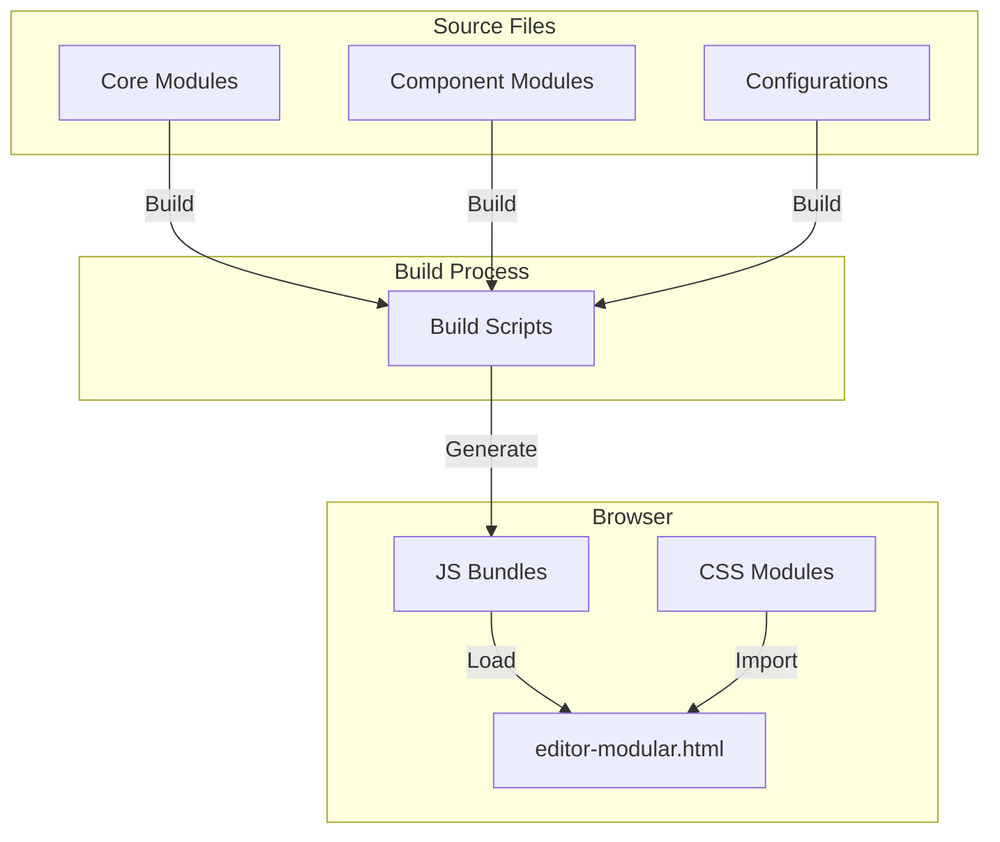
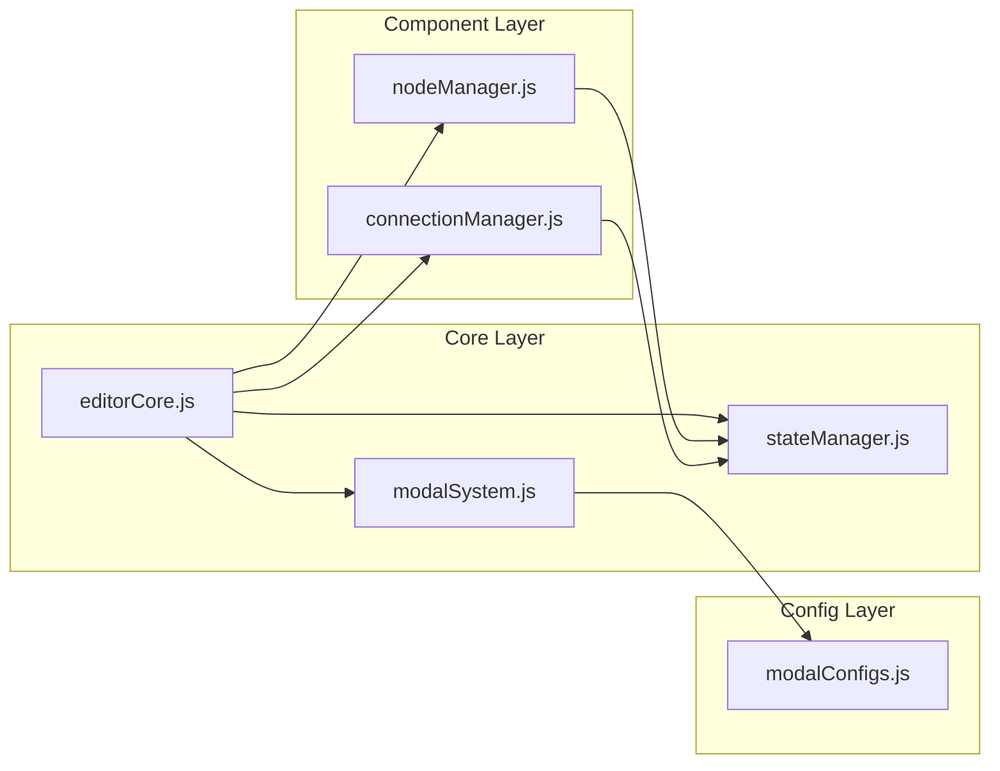
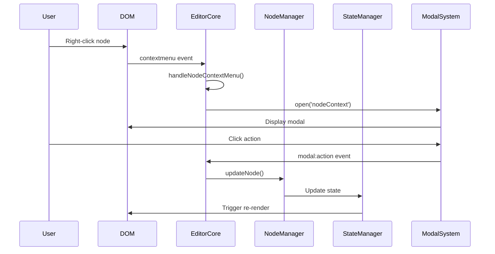
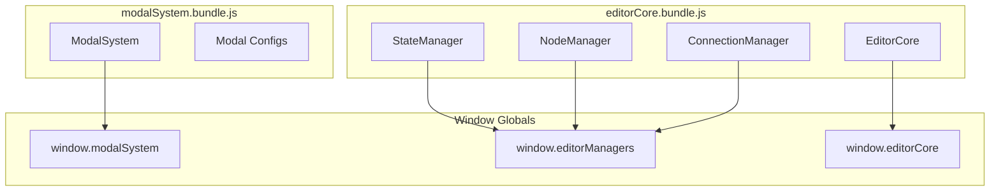
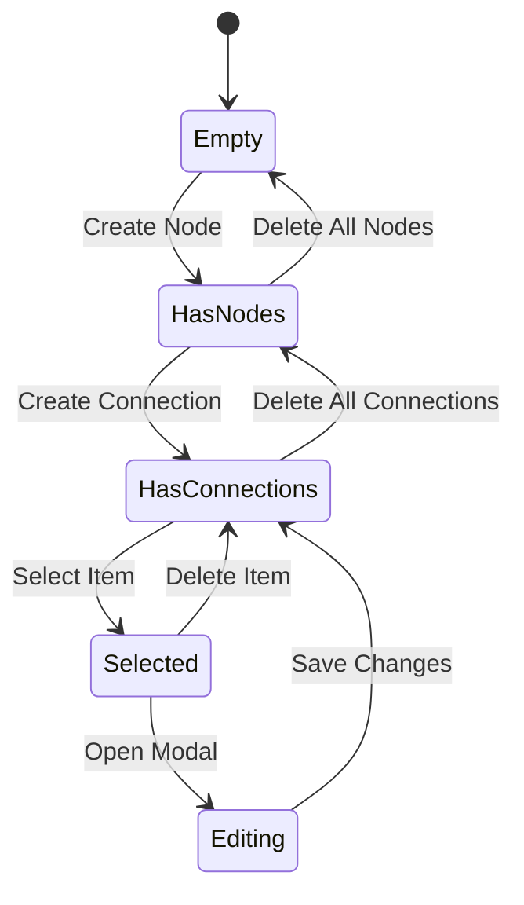
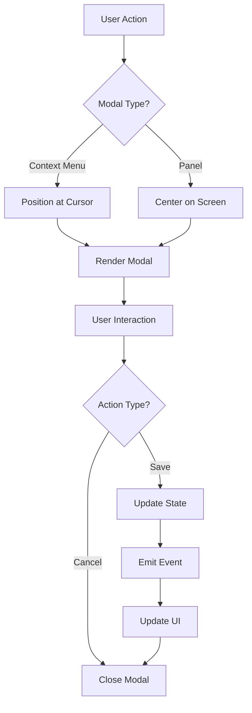
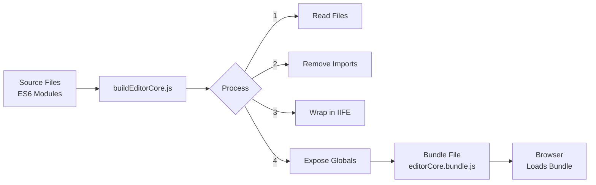

# 🏛️ Mermaid Editor Architecture

## System Overview



## Module Dependencies



## Event Flow



## Bundle Architecture



## File System Structure

```
mermaid-editor/
│
├── 📄 index.html                    # ES6 module entry (experimental)
├── 📄 EDITING_MANUAL.md            # Comprehensive editing guide
├── 📄 QUICK_REFERENCE.md           # Quick reference card
├── 📄 ARCHITECTURE.md              # This file
│
├── 📄 mermaid_editor.html          ✅ MAIN VERSION (modular architecture)
│
├── 📁 views/                       # HTML versions (archives)
│   ├── 📄 editor-modular.html      📋 Original modular version
│   ├── 📄 editor-interactive.html  ❌ Legacy monolithic (DO NOT EDIT)
│   └── 📄 [other versions]         ⚠️  Various experiments
│
├── 📁 js/                          # JavaScript modules
│   ├── 📁 core/                    # Core systems
│   │   ├── 📄 editorCore.js        # Main coordinator
│   │   ├── 📄 stateManager.js      # State management
│   │   └── 📄 modalSystem.js       # Modal/popup system
│   │
│   ├── 📁 components/              # Feature managers
│   │   ├── 📄 nodeManager.js       # Node operations
│   │   └── 📄 connectionManager.js # Connection operations
│   │
│   ├── 📁 config/                  # Configuration
│   │   └── 📄 modalConfigs.js      # All modal definitions
│   │
│   ├── 📁 build/                   # Build scripts
│   │   └── 📄 buildEditorCore.js   # Bundle builder
│   │
│   └── 📁 bundles/                 # Generated (DO NOT EDIT)
│       └── 📄 editorCore.bundle.js
│
└── 📁 css/                         # Stylesheets
    ├── 📄 main.css                 # Main importer
    ├── 📁 base/                    # Foundation
    ├── 📁 components/              # Component styles
    └── 📁 layout/                  # Layout styles
```

## Key Design Patterns

### 1. Manager Pattern
Each manager handles a specific domain:
- `NodeManager`: All node-related operations
- `ConnectionManager`: All connection-related operations
- `StateManager`: Application state and history

### 2. Event-Driven Architecture
Components communicate through custom events:
```javascript
// Emitting
document.dispatchEvent(new CustomEvent('node:nodeClick', { 
    detail: { node, event } 
}));

// Listening
document.addEventListener('node:nodeClick', handler);
```

### 3. Bundle Strategy
ES6 modules are bundled into IIFE for browser compatibility:
```javascript
// Source (ES6)
export class NodeManager { }

// Bundle (IIFE)
(function(window) {
    class NodeManager { }
    window.NodeManager = NodeManager;
})(window);
```

### 4. Adapter Pattern
Legacy code is adapted to new architecture:
```javascript
// Legacy function mapped to new API
window.createNode = (...args) => window.editorCore.nodeManager.createNode(...args);
```

## State Management



## Modal System Flow



## Build Process Detail



## Critical Understanding Points

1. **Two-Stage Loading**: Source → Bundle → Browser
2. **Global Exposure**: Bundles expose APIs via `window` object
3. **Event Bus**: Custom events enable loose coupling
4. **Single Source of Truth**: Modal configs, state, etc.
5. **Rebuild Required**: JS changes need bundle rebuild

## Common Workflows

### Adding a Feature
1. Identify appropriate manager/module
2. Add feature to source file
3. Rebuild bundle
4. Test in browser

### Fixing a Bug
1. Debug in browser console
2. Trace to source file
3. Fix in source
4. Rebuild and test

### Styling Changes
1. Edit CSS file directly
2. No rebuild needed
3. Refresh browser

---

This architecture enables:
- ✅ Maintainable codebase
- ✅ Clear separation of concerns
- ✅ Easy debugging
- ✅ Extensibility
- ✅ Browser compatibility